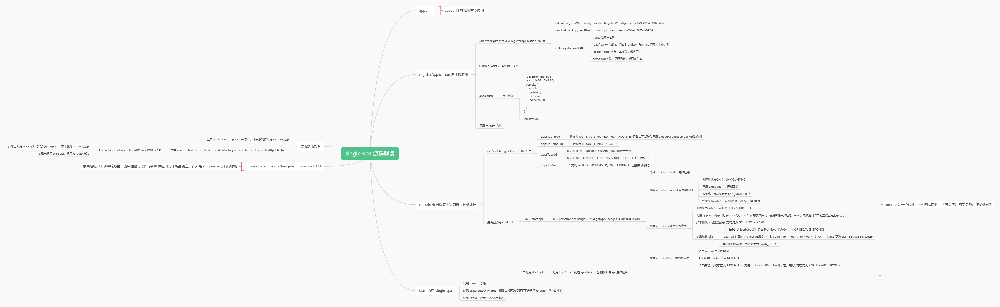
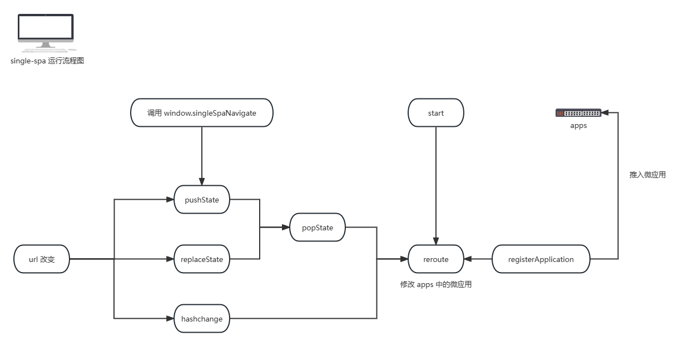

# single-spa 源码解读

阅读 single-spa 源码可以帮助我们理解微前端这个概念，以及微前端的整个运行机制。

该项目梳理了 single-spa 运行机制，源码包含大量注释，建议搭配 [single-spa 源码解读思维导图](https://www.processon.com/view/64b0f974712d76744da7c108) 和 [single-spa 运行流程图](https://www.processon.com/view/64b3d980cf023908bc011672) 理解。

```
注意：源码只注解核心部分的应用，sigle-spa 还包含自定义 window 事件的发布、parcel 等概念，这些都不在本次解读范畴。
```

#### 图解

- single-spa 源码解读思维导图


- single-spa 运行流程图


#### 文档

[single-spa 官方文档](https://zh-hans.single-spa.js.org/docs)

[single-spa 源码解读思维导图](https://www.processon.com/view/64b0f974712d76744da7c108)

[single-spa 运行流程图](https://www.processon.com/view/64b3d980cf023908bc011672)